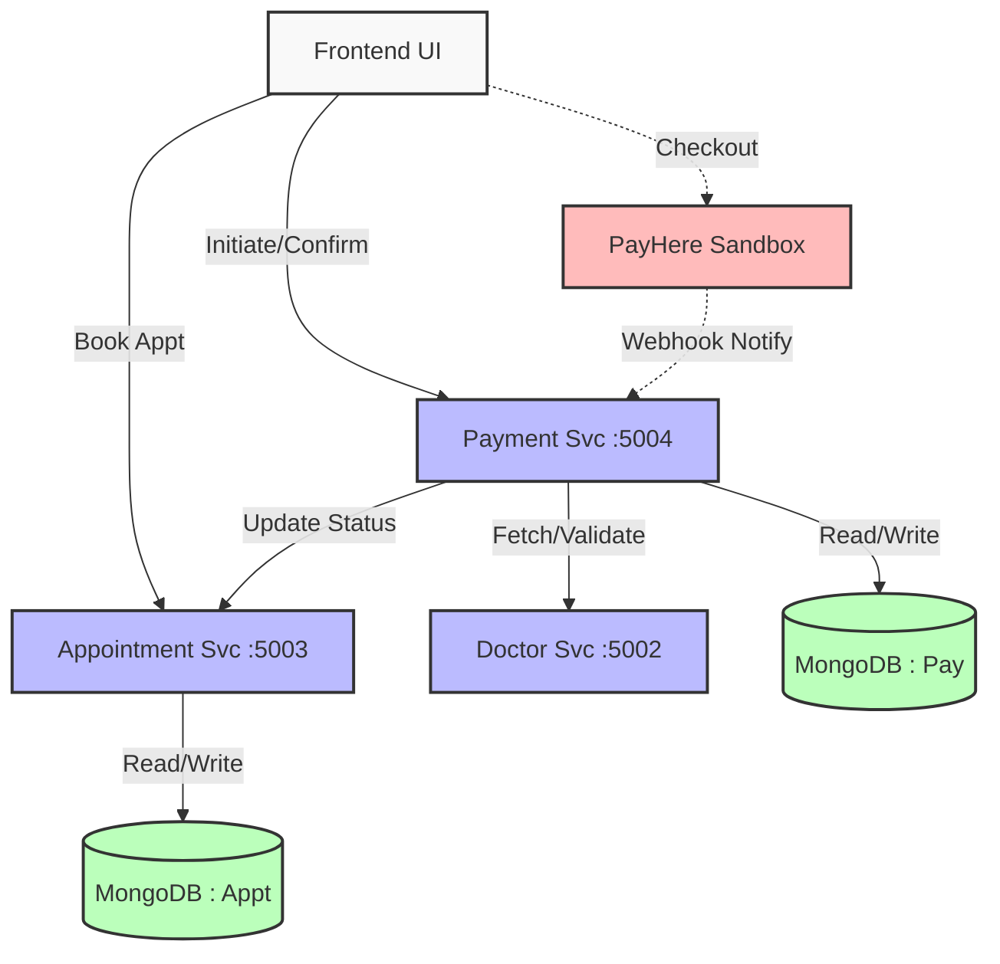
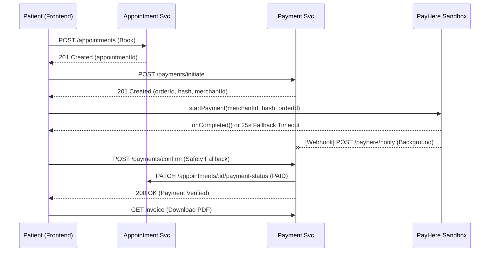

# 🏥 PrimeHealth — Sithmi's Module: Appointment & Payment

> **Owner:** Sithmi  
> **Services:** `appointment-service` (`:5003`) · `payment-service` (`:5004`)  
> **Stack:** Node.js · Express · MongoDB (Mongoose) · Docker · Kubernetes

---

## 📁 Folder Structure

```
PrimeHealth-microservices-main/
├── Frontend_UI/                    # Dark-mode Testing UI
│   ├── index.html
│   ├── style.css
│   └── app.js
├── docs/
│   └── Sithmi_Guide.md            ← YOU ARE HERE
├── micro-services/
│   ├── docker/
│   │   ├── docker-compose.yml
│   │   └── .env.example
│   ├── k8s/
│   │   ├── appointment-deployment.yaml
│   │   ├── appointment-service.yaml
│   │   ├── payment-deployment.yaml
│   │   ├── payment-service.yaml
│   │   ├── doctor-deployment.yaml
│   │   ├── doctor-service.yaml
│   │   ├── configmap.yaml
│   │   └── secret.yaml
│   └── services/
│       ├── appointment-service/
│       │   ├── Dockerfile
│       │   ├── .env.example
│       │   ├── package.json
│       │   └── src/
│       │       ├── app.js
│       │       ├── server.js
│       │       ├── config/    (db.js, logger.js, swagger.js)
│       │       ├── controllers/appointmentController.js
│       │       ├── middleware/ (auth.js, errorHandler.js, notFound.js, requestLogger.js)
│       │       ├── models/Appointment.js
│       │       ├── routes/appointmentRoutes.js
│       │       ├── services/  (appointmentService.js, doctorClient.js)
│       │       └── utils/     (ApiError.js, validate.js)
│       └── payment-service/
│           ├── Dockerfile
│           ├── .env.example
│           ├── package.json
│           └── src/
│               ├── app.js
│               ├── server.js
│               ├── config/    (db.js, logger.js, swagger.js)
│               ├── controllers/paymentController.js
│               ├── middleware/ (auth.js, errorHandler.js, notFound.js, requestLogger.js)
│               ├── models/Payment.js
│               ├── routes/paymentRoutes.js
│               ├── services/  (paymentService.js, appointmentClient.js, invoiceService.js)
│               └── utils/     (ApiError.js, validate.js, pdfGenerator.js, generateOrderId.js)
```

---

## 🔧 Environment Variables

### Appointment Service (`.env`)
```env
PORT=5003
NODE_ENV=development
MONGO_URI=mongodb://localhost:27017/primehealth_appointment
LOG_LEVEL=debug
CORS_ORIGIN=*
DOCTOR_SERVICE_URL=http://localhost:5002
PAYMENT_SERVICE_URL=http://localhost:5004
```

### Payment Service (`.env`)
```env
PORT=5004
NODE_ENV=development
MONGO_URI=mongodb://localhost:27017/primehealth_payment
LOG_LEVEL=debug
CORS_ORIGIN=*
APPOINTMENT_SERVICE_URL=http://localhost:5003
PAYHERE_MERCHANT_ID=1228221
PAYHERE_MERCHANT_SECRET=NDQ3MzIyNDgzMDI0NzQxNzU2OTAxNDA4NzkxODA2NTM5NDQxOTA=
```

> **Setup:** Copy `.env.example` → `.env` in each service folder, then update `MONGO_URI` with your connection string. Make sure the `PAYHERE_` keys match your actual sandbox credentials if running real transactions.

---

## 🏗 Architecture




### Inter-Service Communication
- **Payment → Appointment:** When payment is confirmed (`SUCCESS`), the Payment Service calls  
  `PATCH /api/appointments/{id}/payment-status` to set `paymentStatus = PAID` and auto-confirm.
- **Appointment → Doctor:** On booking, the Appointment Service calls Doctor Service to validate availability.

### Design Patterns Used
| Pattern                | Where                                      |
|------------------------|-------------------------------------------|
| MVC (Model-View-Controller) | Controllers → Services → Models      |
| Repository Pattern     | Services abstract Mongoose queries         |
| Inter-Service Client   | `doctorClient.js`, `appointmentClient.js`  |
| Centralized Error Handling | `ApiError` + `errorHandler` middleware |
| Queue Management       | `queueNumber` + `getQueuePosition()`       |
| PDF Invoice Generation | `pdfkit` stream to HTTP response           |

---

## 📡 API Endpoints

### Appointment Service (`:5003`)

| Method | Endpoint | Auth | Description |
|--------|----------|------|-------------|
| `POST` | `/api/appointments` | — | Book a new appointment |
| `GET`  | `/api/appointments` | — | List all (with filters: doctorId, patientId, status, paymentStatus, date) |
| `GET`  | `/api/appointments/my` | PATIENT | Get my appointments |
| `GET`  | `/api/appointments/doctor/:doctorId/slots?date=YYYY-MM-DD` | — | Get available time slots |
| `GET`  | `/api/appointments/:id` | — | Get single appointment |
| `GET`  | `/api/appointments/:id/queue` | PATIENT | Get live queue position |
| `PATCH`| `/api/appointments/:id/cancel` | PATIENT/ADMIN | Cancel an appointment |
| `PATCH`| `/api/appointments/:id/status` | DOCTOR/ADMIN | Update status (CONFIRMED/COMPLETED) |
| `PATCH`| `/api/appointments/:id/payment-status` | Internal | Update payment status (called by Payment Service) |
| `DELETE`| `/api/appointments/:id` | ADMIN | Hard delete |
| `GET`  | `/health` | — | Health check |
| `GET`  | `/api-docs` | — | Swagger UI |

### Payment Service (`:5004`)

| Method | Endpoint | Auth | Description |
|--------|----------|------|-------------|
| `POST` | `/api/payments/initiate` | — | Create a pending payment (returns orderId) |
| `POST` | `/api/payments/confirm` | — | Confirm payment by orderId (simulated gateway) |
| `GET`  | `/api/payments` | ADMIN/PATIENT | List all payments |
| `GET`  | `/api/payments/my` | PATIENT | Get my payments |
| `GET`  | `/api/payments/order/:orderId` | — | Get payment by order ID |
| `GET`  | `/api/payments/:id` | ADMIN/PATIENT | Get single payment |
| `POST` | `/api/payments/:id/refund` | ADMIN | Process a refund |
| `GET`  | `/api/payments/:id/invoice` | ADMIN/PATIENT | Download PDF invoice |
| `GET`  | `/health` | — | Health check |
| `GET`  | `/api/docs` | — | Swagger UI |

### Auth Headers (Mock)
```
x-user-id: p-123
x-user-role: PATIENT   (PATIENT | DOCTOR | ADMIN)
```

---

## 🚀 Step-by-Step: Run Locally

### Prerequisites
- Node.js ≥ 18
- MongoDB running locally or a MongoDB Atlas URI
- Docker & Docker Compose (for containerized run)

### Option A: Manual (Individual Services)
```bash
# 1. Appointment Service
cd micro-services/services/appointment-service
cp .env.example .env          # Edit MONGO_URI if needed
npm install
npm run dev                   # Starts on :5003

# 2. Payment Service (new terminal)
cd micro-services/services/payment-service
cp .env.example .env          # Edit MONGO_URI if needed
npm install
npm run dev                   # Starts on :5004

# 3. Open Frontend
open Frontend_UI/index.html   # Or use Live Server
```

### Option B: Docker Compose
```bash
cd micro-services/docker
cp .env.example .env          # Set all MONGO_URI_* values
docker-compose up --build
```

### Option C: Kubernetes
```bash
cd micro-services/k8s
kubectl apply -f configmap.yaml
kubectl apply -f secret.yaml
kubectl apply -f appointment-deployment.yaml
kubectl apply -f appointment-service.yaml
kubectl apply -f payment-deployment.yaml
kubectl apply -f payment-service.yaml
```

---

## 🧪 Testing Checklist (Step-by-Step Demo)

### Step 1: Health Checks ✅
```bash
curl http://localhost:5003/health
# → { "success": true, "message": "OK", "data": { "service": "appointment-service" } }

curl http://localhost:5004/health
# → { "status": "UP", "service": "payment-service" }
```

### Step 2: Book an Appointment ✅
```bash
curl -X POST http://localhost:5003/api/appointments \
  -H "Content-Type: application/json" \
  -H "x-user-id: p-123" \
  -H "x-user-role: PATIENT" \
  -d '{
    "patientId": "p-123",
    "doctorId": "d-001",
    "doctorName": "Dr. Smith",
    "specialty": "Cardiology",
    "appointmentDate": "2026-04-20",
    "startTime": "09:00",
    "reason": "Chest pain",
    "consultationFee": 2000
  }'
```
**Expected:** 201 Created, `status: "PENDING"`, `paymentStatus: "UNPAID"`, `queueNumber: 1`

### Step 3: View My Appointments ✅
```bash
curl http://localhost:5003/api/appointments/my \
  -H "x-user-id: p-123" \
  -H "x-user-role: PATIENT"
```

### Step 4: Check Queue Position ✅
```bash
curl http://localhost:5003/api/appointments/{APPOINTMENT_ID}/queue \
  -H "x-user-id: p-123" \
  -H "x-user-role: PATIENT"
# → { myQueueNumber: 1, peopleAheadOfMe: 0, estimatedWaitMinutes: 0 }
```

### Step 5: Check Available Slots ✅
```bash
curl "http://localhost:5003/api/appointments/doctor/d-001/slots?date=2026-04-20"
# → { freeSlots: ["08:00", "08:30", "09:30", ...], takenSlots: ["09:00"] }
```

### Step 6: Initiate Payment ✅
```bash
curl -X POST http://localhost:5004/api/payments/initiate \
  -H "Content-Type: application/json" \
  -H "x-user-id: p-123" \
  -H "x-user-role: PATIENT" \
  -d '{
    "appointmentId": "{APPOINTMENT_ID}",
    "patientId": "p-123",
    "doctorId": "d-001",
    "amount": 2000,
    "method": "CREDIT_CARD"
  }'
```
**Expected:** 201 Created, `status: "PENDING"`, returns `orderId: "ORD-XXXXX-XXXXX"`

### Step 7: Confirm Payment ✅
```bash
curl -X POST http://localhost:5004/api/payments/confirm \
  -H "Content-Type: application/json" \
  -d '{ "orderId": "ORD-XXXXX-XXXXX" }'
```
**Expected:** 200 OK, `status: "SUCCESS"`, returns `transactionId`

> ⚠️ **Note:** The mock gateway has a 90% success rate. If it fails, retry.

### Step 8: Verify Appointment Auto-Confirmed ✅
```bash
curl http://localhost:5003/api/appointments/{APPOINTMENT_ID}
# → status: "CONFIRMED", paymentStatus: "PAID"
```
This proves **inter-service communication** works.

### Step 9: Download PDF Invoice ✅
```bash
curl http://localhost:5004/api/payments/{PAYMENT_ID}/invoice \
  -H "x-user-id: p-123" \
  -H "x-user-role: PATIENT" \
  --output invoice.pdf
```
Open `invoice.pdf` — should contain invoice number, transaction ID, amount, etc.

### Step 10: Cancel an Appointment ✅
```bash
curl -X PATCH http://localhost:5003/api/appointments/{APPOINTMENT_ID}/cancel \
  -H "x-user-id: p-123" \
  -H "x-user-role: PATIENT"
# → status: "CANCELLED"
```

### Step 11: Process Refund (Admin) ✅
```bash
curl -X POST http://localhost:5004/api/payments/{PAYMENT_ID}/refund \
  -H "x-user-id: admin-1" \
  -H "x-user-role: ADMIN"
# → status: "REFUNDED"
```

### Step 12: View Payment History ✅
```bash
curl http://localhost:5004/api/payments?patientId=p-123 \
  -H "x-user-id: p-123" \
  -H "x-user-role: PATIENT"
```

---

## ✅ FULL ASSIGNMENT CHECKLIST

### 1. Core Backend Features

| # | Requirement | Status | Where |
|---|-------------|--------|-------|
| 1 | Patient can book an appointment | ✅ | `POST /api/appointments` |
| 2 | Patient can view their appointments | ✅ | `GET /api/appointments/my` |
| 3 | Patient can cancel an appointment | ✅ | `PATCH /api/appointments/:id/cancel` |
| 4 | Appointment status is tracked | ✅ | `PENDING → CONFIRMED → COMPLETED / CANCELLED` |
| 5 | Payment can be initiated for an appointment | ✅ | `POST /api/payments/initiate` |
| 6 | Payment can be confirmed successfully | ✅ | `POST /api/payments/confirm` |
| 7 | Successful payment updates appointment to PAID/CONFIRMED | ✅ | Inter-service call in `paymentService.confirmPayment()` |
| 8 | Payment history is available | ✅ | `GET /api/payments?patientId=...` |
| 9 | Role-based access enforced (PATIENT/DOCTOR/ADMIN) | ✅ | `auth.js` middleware with `x-user-role` header |

### 2. Advanced Features

| # | Feature | Status | Where |
|---|---------|--------|-------|
| 10 | Queue number generation | ✅ | Auto-assigned on booking in `appointmentService.createAppointment()` |
| 11 | Queue position display (live) | ✅ | `GET /api/appointments/:id/queue` |
| 12 | PDF invoice generation | ✅ | `GET /api/payments/:id/invoice` (pdfkit stream) |
| 13 | Available slots endpoint | ✅ | `GET /api/appointments/doctor/:doctorId/slots?date=...` |
| 14 | Refund endpoint | ✅ | `POST /api/payments/:id/refund` |
| 15 | Order ID based payment tracking | ✅ | `orderId` field + `GET /api/payments/order/:orderId` |

### 3. Architecture & Design

| # | Requirement | Status | Where |
|---|-------------|--------|-------|
| 16 | RESTful API design | ✅ | All routes follow REST conventions |
| 17 | Microservice separation | ✅ | Appointment (`:5003`) + Payment (`:5004`) |
| 18 | Inter-service HTTP communication | ✅ | `appointmentClient.js` ↔ `doctorClient.js` |
| 19 | MVC / Layered architecture | ✅ | Controller → Service → Model |
| 20 | Input validation | ✅ | `express-validator` in routes |
| 21 | Error handling | ✅ | `ApiError` class + `errorHandler` middleware |
| 22 | Request logging | ✅ | `requestLogger` middleware |
| 23 | Health check endpoint | ✅ | `GET /health` on both services |
| 24 | Swagger/OpenAPI docs | ✅ | `/api-docs` (appointment) · `/api/docs` (payment) |

### 4. Models & Database

| # | Requirement | Status | Where |
|---|-------------|--------|-------|
| 25 | Appointment schema with all fields | ✅ | `Appointment.js` — 14 fields + timestamps |
| 26 | Payment schema with orderId/transactionId | ✅ | `Payment.js` — orderId, transactionId, invoiceNumber |
| 27 | Compound unique index (prevent double booking) | ✅ | `{ doctorId, appointmentDate, startTime }` |
| 28 | Patient lookup index | ✅ | `{ patientId, appointmentDate }` |
| 29 | Past-date validation | ✅ | `appointmentService.createAppointment()` rejects past dates |

### 5. Docker & Kubernetes

| # | Requirement | Status | Where |
|---|-------------|--------|-------|
| 30 | Dockerfile for each service | ✅ | `appointment-service/Dockerfile` + `payment-service/Dockerfile` |
| 31 | `.dockerignore` | ✅ | Both services |
| 32 | `docker-compose.yml` | ✅ | `micro-services/docker/docker-compose.yml` |
| 33 | K8s Deployment manifests | ✅ | `k8s/appointment-deployment.yaml` + `k8s/payment-deployment.yaml` |
| 34 | K8s Service manifests | ✅ | `k8s/appointment-service.yaml` + `k8s/payment-service.yaml` |
| 35 | K8s ConfigMap | ✅ | `k8s/configmap.yaml` |
| 36 | K8s Secret | ✅ | `k8s/secret.yaml` |

### 6. Frontend (Testing UI)

| # | Requirement | Status | Where |
|---|-------------|--------|-------|
| 37 | Book appointment form | ✅ | `Frontend_UI/index.html` — booking form |
| 38 | View my appointments (with search) | ✅ | "My Appointments" tab with patient ID search |
| 39 | Pay for appointment | ✅ | Auto-redirect after booking → initiate → confirm flow |
| 40 | Cancel appointment | ✅ | Cancel button in appointments table |
| 41 | Queue position check | ✅ | Queue button in appointments table |
| 42 | Payment history with invoice download | ✅ | "Payment History" tab with download buttons |
| 43 | Status badges (color-coded) | ✅ | CSS badges for PENDING/CONFIRMED/PAID/etc. |
| 44 | Modern dark-mode UI | ✅ | Glassmorphism, gradients, animations |

### 7. Documentation & Config

| # | Requirement | Status | Where |
|---|-------------|--------|-------|
| 45 | `.env.example` for each service | ✅ | Both services have `.env.example` |
| 46 | Developer guide (this file) | ✅ | `docs/Sithmi_Guide.md` |
| 47 | API documentation (Swagger) | ✅ | `/api-docs` and `/api/docs` |
| 48 | Architecture diagram | ✅ | ASCII diagram in this guide |
| 49 | README updated | ✅ | Root `README.md` |

---

## 🔢 Data Models

### Appointment Schema
```javascript
{
  patientId:       String (required),
  doctorId:        String (required),
  doctorName:      String (required),
  specialty:       String,
  appointmentDate: Date (required),
  startTime:       String (required, "HH:mm"),
  endTime:         String (required),
  reason:          String,
  consultationFee: Number (default: 0),
  queueNumber:     Number,
  status:          "PENDING" | "CONFIRMED" | "CANCELLED" | "COMPLETED",
  paymentStatus:   "UNPAID" | "PENDING" | "PAID" | "FAILED" | "REFUNDED",
  paymentId:       String (reference to Payment),
  notes:           String,
  createdAt:       Date (auto),
  updatedAt:       Date (auto)
}
```

### Payment Schema
```javascript
{
  appointmentId:   ObjectId (required),
  patientId:       String (required),
  doctorId:        String,
  orderId:         String (unique, required, e.g. "ORD-XXXXX"),
  transactionId:   String (unique, sparse — set on success),
  amount:          Number (required),
  currency:        String (default: "LKR"),
  method:          "CREDIT_CARD" | "CASH" | "INSURANCE",
  status:          "PENDING" | "SUCCESS" | "FAILED" | "REFUNDED",
  paidAt:          Date (set on success),
  failureReason:   String (set on failure),
  gatewayResponse: Mixed (for real gateway data),
  invoiceNumber:   String (set on success),
  createdAt:       Date (auto),
  updatedAt:       Date (auto)
}
```

---

## 💡 Important Notes for Demo / Viva

1. **Mock Payment Gateway** — The system uses a simulated gateway (90% success rate). In production, replace `_mockPaymentGateway()` in `paymentService.js` with Stripe/PayHere SDK.

2. **Mock Authentication** — Auth is header-based (`x-user-id`, `x-user-role`). In production, use JWT tokens with the Auth Service.

3. **Inter-Service Communication** — Uses synchronous HTTP (axios). In production, consider RabbitMQ/Kafka for reliability.

4. **Two-Step Payment Flow** — `Initiate → Confirm` pattern mirrors real payment gateways (Stripe's PaymentIntents, PayHere's checkout flow).

5. **Queue System** — Queue numbers are assigned per-doctor per-day. `getQueuePosition()` calculates live position by counting active appointments with lower queue numbers.

6. **PDF Invoices** — Generated on-the-fly using `pdfkit` and streamed directly to the browser (no file saved on server).

### Payment Flow Sequence



---

## 📊 For the Report

### Screenshots to Include
1. Frontend booking form (dark mode UI)
2. Swagger docs page (`/api-docs`)
3. Postman/curl showing successful booking
4. Postman/curl showing payment initiate → confirm
5. PDF invoice download
6. Docker containers running (`docker ps`)
7. K8s pods running (`kubectl get pods`)

### Key Technical Points to Mention
- Node.js + Express + MongoDB microservices architecture
- REST API with express-validator input validation
- Inter-service communication via HTTP (axios)
- Role-based access control middleware
- Queue management with automatic numbering
- PDF invoice generation using pdfkit
- Docker containerization with multi-service compose
- Kubernetes orchestration with Deployments, Services, ConfigMaps, and Secrets

---

---

## 📅 Day-by-Day Build Schedule

> **Rule:** Follow this order exactly. Do **not** touch Docker/Kubernetes until the local flow works. Do **not** polish the frontend before the backend is proven in Postman.

---

### 🗓 Day 1 — Service Skeletons

**Goal:** Both services start, `/health` works, MongoDB connects, `/api-docs` opens.

**What to build:**

Appointment Service (`micro-services/services/appointment-service/`)
- [x] `package.json`
- [x] `.env.example`
- [x] `Dockerfile`
- [x] `.dockerignore`
- [x] `src/app.js`
- [x] `src/server.js`
- [x] `src/config/db.js`
- [x] `src/config/logger.js`
- [x] `src/config/swagger.js`
- [x] `src/middleware/auth.js`
- [x] `src/middleware/errorHandler.js`
- [x] `src/middleware/notFound.js`
- [x] `src/middleware/requestLogger.js`
- [x] `src/utils/ApiError.js`
- [x] `src/utils/validate.js`

Payment Service (`micro-services/services/payment-service/`)
- [x] `package.json`
- [x] `.env.example`
- [x] `Dockerfile`
- [x] `.dockerignore`
- [x] `src/app.js`
- [x] `src/server.js`
- [x] `src/config/db.js`
- [x] `src/config/logger.js`
- [x] `src/config/swagger.js`
- [x] `src/middleware/auth.js`
- [x] `src/middleware/errorHandler.js`
- [x] `src/middleware/notFound.js`
- [x] `src/middleware/requestLogger.js`
- [x] `src/utils/ApiError.js`
- [x] `src/utils/validate.js`
- [x] `src/utils/generateOrderId.js`

**Day 1 completion targets:**
- [ ] `npm run dev` starts both services without error
- [ ] `GET /health` returns 200 on both
- [ ] MongoDB connects (check logs)
- [ ] `GET /api-docs` renders Swagger UI

**Files to push to GitHub (end of Day 1):**
```
micro-services/services/appointment-service/package.json
micro-services/services/appointment-service/.env.example
micro-services/services/appointment-service/Dockerfile
micro-services/services/appointment-service/.dockerignore
micro-services/services/appointment-service/src/app.js
micro-services/services/appointment-service/src/server.js
micro-services/services/appointment-service/src/config/db.js
micro-services/services/appointment-service/src/config/logger.js
micro-services/services/appointment-service/src/config/swagger.js
micro-services/services/appointment-service/src/middleware/auth.js
micro-services/services/appointment-service/src/middleware/errorHandler.js
micro-services/services/appointment-service/src/middleware/notFound.js
micro-services/services/appointment-service/src/middleware/requestLogger.js
micro-services/services/appointment-service/src/utils/ApiError.js
micro-services/services/appointment-service/src/utils/validate.js
micro-services/services/payment-service/package.json
micro-services/services/payment-service/.env.example
micro-services/services/payment-service/Dockerfile
micro-services/services/payment-service/.dockerignore
micro-services/services/payment-service/src/app.js
micro-services/services/payment-service/src/server.js
micro-services/services/payment-service/src/config/db.js
micro-services/services/payment-service/src/config/logger.js
micro-services/services/payment-service/src/config/swagger.js
micro-services/services/payment-service/src/middleware/auth.js
micro-services/services/payment-service/src/middleware/errorHandler.js
micro-services/services/payment-service/src/middleware/notFound.js
micro-services/services/payment-service/src/middleware/requestLogger.js
micro-services/services/payment-service/src/utils/ApiError.js
micro-services/services/payment-service/src/utils/validate.js
micro-services/services/payment-service/src/utils/generateOrderId.js
```

**Git commit message:**
```
feat: scaffold appointment-service and payment-service skeletons

- add package.json, Dockerfile, .env.example for both services
- set up Express app with health endpoint, CORS, helmet, JSON parsing
- configure Winston logger and Mongoose db connection
- add auth, errorHandler, notFound, requestLogger middleware
- add ApiError utility and express-validator wrapper
- add generateOrderId utility for payment order tracking
- Swagger UI available at /api-docs (appointment) and /api/docs (payment)
```

---

### 🗓 Day 2 — Appointment Model & APIs

**Goal:** All appointment endpoints work and are testable in Postman.

**What to build (in this exact order):**

1. **`src/models/Appointment.js`**
   - [x] All 14 fields: `patientId`, `doctorId`, `doctorName`, `specialty`, `appointmentDate`, `startTime`, `endTime`, `reason`, `consultationFee`, `queueNumber`, `status`, `paymentStatus`, `paymentId`, `notes`
   - [x] Status enum: `PENDING | CONFIRMED | CANCELLED | COMPLETED`
   - [x] PaymentStatus enum: `UNPAID | PENDING | PAID | FAILED | REFUNDED`
   - [x] Compound unique index on `{ doctorId, appointmentDate, startTime }` (partialFilter: status ≠ CANCELLED)
   - [x] Indexes for `patientId` and `doctorId` lookups

2. **`src/routes/appointmentRoutes.js`**
   - [x] `POST   /api/appointments` — book
   - [x] `GET    /api/appointments/my` — patient's own list
   - [x] `GET    /api/appointments/doctor/:doctorId/slots` — available timeslots
   - [x] `GET    /api/appointments` — list all (filtered)
   - [x] `GET    /api/appointments/:id` — single
   - [x] `GET    /api/appointments/:id/queue` — queue position
   - [x] `PATCH  /api/appointments/:id/cancel` — cancel
   - [x] `PATCH  /api/appointments/:id/status` — doctor/admin update
   - [x] `PATCH  /api/appointments/:id/payment-status` — internal (called by payment-service)

3. **`src/controllers/appointmentController.js`**
   - [x] `createAppointment`
   - [x] `getMyAppointments`
   - [x] `getAvailableSlots`
   - [x] `getAllAppointments`
   - [x] `getAppointmentById`
   - [x] `getQueuePosition`
   - [x] `cancelAppointment`
   - [x] `updateAppointmentStatus`
   - [x] `updatePaymentStatus`

4. **`src/services/appointmentService.js`**
   - [x] Reject past dates
   - [x] Reject duplicate slots (409 error)
   - [x] Auto-assign queue number (count active appts for same doctor + date + 1)
   - [x] Create appointment as `PENDING` + `UNPAID`
   - [x] Cancel only if not COMPLETED
   - [x] `updatePaymentStatus` auto-confirms if PAID + PENDING
   - [x] `getAvailableSlots` generates 08:00–17:00 slots minus taken ones
   - [x] `getQueuePosition` counts active appts with lower queue number

**Day 2 completion targets:**
- [ ] `POST /api/appointments` creates appointment in Postman
- [ ] `GET /api/appointments/my?patientId=p-123` returns list
- [ ] `PATCH /api/appointments/:id/cancel` cancels appointment
- [ ] `GET /api/appointments/doctor/:doctorId/slots?date=YYYY-MM-DD` returns free slots
- [ ] Duplicate slot returns 409
- [ ] Past date returns 400

**Files to push to GitHub (end of Day 2):**
```
micro-services/services/appointment-service/src/models/Appointment.js
micro-services/services/appointment-service/src/routes/appointmentRoutes.js
micro-services/services/appointment-service/src/controllers/appointmentController.js
micro-services/services/appointment-service/src/services/appointmentService.js
```

**Git commit message:**
```
feat(appointment-service): implement full appointment CRUD and queue management

- add Appointment model with 14 fields, status/paymentStatus enums
- add compound unique index to prevent double-booking
- implement createAppointment with past-date and duplicate-slot validation
- auto-assign queue number per doctor per day
- implement getMyAppointments, getAppointmentById, cancelAppointment
- implement getAvailableSlots (08:00-17:00 in 30min increments)
- implement getQueuePosition with estimated wait time
- add updatePaymentStatus (auto-confirms appointment on PAID)
- add all routes with express-validator input validation
- add Swagger JSDoc annotations on all routes
```

---

### 🗓 Day 3 — Payment Model & APIs

**Goal:** Payment initiation, confirmation, and history work in Postman.

**What to build (in this exact order):**

1. **`src/models/Payment.js`**
   - [x] All 13 fields: `appointmentId`, `patientId`, `doctorId`, `orderId`, `transactionId`, `amount`, `currency`, `method`, `status`, `paidAt`, `failureReason`, `gatewayResponse`, `invoiceNumber`
   - [x] Status enum: `PENDING | SUCCESS | FAILED | REFUNDED`
   - [x] Method enum: `CREDIT_CARD | CASH | INSURANCE`
   - [x] Unique index on `orderId`
   - [x] Sparse unique index on `transactionId`

2. **`src/utils/generateOrderId.js`**
   - [x] Generates `ORD-<timestamp>-<random>` format

3. **`src/routes/paymentRoutes.js`**
   - [x] `POST   /api/payments/initiate`
   - [x] `POST   /api/payments/confirm`
   - [x] `GET    /api/payments/my`
   - [x] `GET    /api/payments/order/:orderId`
   - [x] `GET    /api/payments`
   - [x] `GET    /api/payments/:id`
   - [x] `POST   /api/payments/:id/refund`
   - [x] `GET    /api/payments/:id/invoice`

4. **`src/controllers/paymentController.js`**
   - [x] `initiatePayment`
   - [x] `confirmPayment`
   - [x] `getMyPayments`
   - [x] `getPaymentByOrderId`
   - [x] `getPayments`
   - [x] `getPaymentById`
   - [x] `processRefund`
   - [x] `downloadInvoice`

5. **`src/services/paymentService.js`**
   - [x] `initiatePayment` — create `PENDING` record with orderId
   - [x] `confirmPayment` — mock gateway (90% success), set `SUCCESS` + `transactionId` + `paidAt` + `invoiceNumber`
   - [x] Block duplicate payment (409 if already SUCCESS)
   - [x] `processRefund` — only if SUCCESS
   - [x] `generateInvoice` — stream PDF via pdfkit

**Day 3 completion targets:**
- [ ] `POST /api/payments/initiate` returns orderId
- [ ] `POST /api/payments/confirm` returns SUCCESS with transactionId
- [ ] `GET /api/payments?patientId=p-123` returns history
- [ ] Double payment attempt returns 409
- [ ] Failed payment returns 400

**Files to push to GitHub (end of Day 3):**
```
micro-services/services/payment-service/src/models/Payment.js
micro-services/services/payment-service/src/routes/paymentRoutes.js
micro-services/services/payment-service/src/controllers/paymentController.js
micro-services/services/payment-service/src/services/paymentService.js
micro-services/services/payment-service/src/utils/generateOrderId.js
```

**Git commit message:**
```
feat(payment-service): implement payment initiation, confirmation, and invoice

- add Payment model with orderId, transactionId, invoiceNumber fields
- add unique index on orderId, sparse unique on transactionId
- implement initiatePayment: creates PENDING record with generated orderId
- implement confirmPayment: mock gateway, sets SUCCESS/FAILED status
- block duplicate payments with 409 on already-SUCCESS records
- implement processRefund: transitions SUCCESS -> REFUNDED
- implement generateInvoice: streams PDF via pdfkit with full payment info
- add all routes with Swagger JSDoc annotations
- add generateOrderId utility (ORD-<timestamp>-<random> format)
```

---

### 🗓 Day 4 — Connect the Two Services

**Goal:** Full end-to-end flow works: Book → Pay → Appointment auto-confirmed.

**What to build:**

Payment Service side:
- [x] **`src/services/appointmentServiceClient.js`**
  - Calls `PATCH /api/appointments/:id/payment-status` after payment success
  - Returns `true/false` (fail silently with logged warning)

Appointment Service side:
- [x] **`src/services/doctorServiceClient.js`** (or `doctorClient.js`)
  - Calls Doctor Service to validate availability
  - Returns `true` if doctor-service is unreachable (graceful fallback so you don't block booking when teammates' service isn't running)
- [x] **`src/services/paymentServiceClient.js`** *(optional reference only)*

**Internal flow to verify:**
```
POST /api/appointments          → appointmentId returned
POST /api/payments/initiate     → orderId returned
POST /api/payments/confirm      → status: SUCCESS
  └─ internally calls →         PATCH /api/appointments/:id/payment-status { paymentStatus: "PAID" }
GET  /api/appointments/:id      → status: "CONFIRMED", paymentStatus: "PAID"
```

**Day 4 completion targets:**
- [ ] Book → Initiate → Confirm all work in Postman IN SEQUENCE
- [ ] After confirm, appointment shows `status: CONFIRMED, paymentStatus: PAID`
- [ ] Doctor service unreachable does NOT crash appointment creation (fallback = allow)

**Files to push to GitHub (end of Day 4):**
```
micro-services/services/payment-service/src/services/appointmentServiceClient.js
micro-services/services/appointment-service/src/services/doctorServiceClient.js
micro-services/services/appointment-service/src/services/paymentServiceClient.js
```

**Git commit message:**
```
feat: connect appointment-service and payment-service with inter-service HTTP

- add appointmentServiceClient in payment-service to update payment status after confirm
- add doctorServiceClient in appointment-service with graceful fallback if doctor-service is down
- add paymentServiceClient reference stub in appointment-service
- payment confirm now triggers appointment CONFIRMED + PAID automatically
- end-to-end booking -> payment flow verified: appointment auto-confirms on success
```

---

### 🗓 Day 5 — Queue Management & Invoice Generation

**Goal:** Queue system works live. PDF invoice downloads correctly.

**Queue feature (appointment-service):**
- [x] `appointmentService.getQueuePosition(id)` — counts `PENDING/CONFIRMED` appts with lower queue number for same doctor/date
- [x] Returns `{ myQueueNumber, peopleAheadOfMe, estimatedWaitMinutes }` (15 min per appt)
- [x] `GET /api/appointments/:id/queue` endpoint active

**Invoice feature (payment-service):**
- [x] **`src/services/invoiceService.js`** — wraps `paymentService.generateInvoice()`
- [x] PDF contains: invoice number, order ID, transaction ID, date, method, appointment ID, patient ID, amount, currency
- [x] Only available for `status: SUCCESS` payments
- [x] Streams directly to HTTP response (Content-Disposition: attachment)

**Day 5 completion targets:**
- [ ] `GET /api/appointments/:id/queue` returns position and wait time
- [ ] `GET /api/payments/:id/invoice` downloads a valid PDF
- [ ] PDF contains the correct payment details

**Files to push to GitHub (end of Day 5):**
```
micro-services/services/appointment-service/src/services/appointmentService.js   (queue update)
micro-services/services/appointment-service/src/controllers/appointmentController.js (queue handler)
micro-services/services/payment-service/src/services/invoiceService.js
micro-services/services/payment-service/src/services/paymentService.js   (invoice stream)
micro-services/services/payment-service/src/controllers/paymentController.js (invoice handler)
```

**Git commit message:**
```
feat: add live queue management and PDF invoice generation

- queue position calculates people ahead by doctor/date/queueNumber
- estimated wait = peopleAheadOfMe × 15 minutes
- invoice streams PDF via pdfkit directly to HTTP response
- invoice includes: invoiceNumber, orderId, transactionId, amount, paidAt
- invoice only available for SUCCESS payments (400 otherwise)
- add invoiceService wrapper for future email/storage extensions
```

---

### 🗓 Day 6 — Frontend Module Pages

**Goal:** Full demo flow works without Postman.

**What to build:**

> If using the existing `Frontend_UI/index.html` (plain HTML/JS) — update the existing files.  
> If using React — create these files:

```
Frontend_UI/src/api/appointmentApi.js
Frontend_UI/src/api/paymentApi.js
Frontend_UI/src/pages/BookAppointment.jsx
Frontend_UI/src/pages/PaymentPage.jsx
Frontend_UI/src/pages/MyAppointments.jsx
Frontend_UI/src/pages/PaymentHistory.jsx
Frontend_UI/src/components/SlotPicker.jsx
Frontend_UI/src/components/QueueBadge.jsx
Frontend_UI/src/components/PaymentStatusBadge.jsx
```

**UI Flow to verify:**
1. Choose doctor → pick date → pick available slot → fill reason → submit
2. Auto-redirect to payment page
3. Click Pay Now → calls initiate → calls confirm
4. Show success screen with queue number + transaction ID
5. My Appointments tab → shows CONFIRMED with PAID badge
6. Payment History tab → shows SUCCESS row → Download Invoice button
7. Cancel button cancels PENDING appointments

**Day 6 completion targets:**
- [ ] Booking form works without Postman
- [ ] Payment flow completes in browser
- [ ] My appointments shows updated status
- [ ] Payment history loads
- [ ] Invoice downloads from browser
- [ ] Cancel appointment works from UI
- [ ] Queue number visible in appointment card

**Files to push to GitHub (end of Day 6):**
```
Frontend_UI/index.html
Frontend_UI/style.css
Frontend_UI/app.js
(or all React page/component/api files if using React)
```

**Git commit message:**
```
feat(frontend): implement complete appointment and payment UI module

- booking form with doctor selector, date picker, and slot auto-population
- initiate → confirm two-step payment flow with loading states
- my appointments page with status/payment badges and cancel button
- queue position display on each appointment card
- payment history page with invoice download button
- error messages shown clearly on all forms
- dark-mode elite design with glassmorphism, gradient headers, animated badges
```

---

### 🗓 Day 7 — Docker

**Goal:** `docker-compose up --build` starts all services. Inter-service calls work via container DNS names.

**What to build:**

Appointment Service:
- [x] `Dockerfile` (already done — verify it builds)
- [x] `.dockerignore` (already done)

Payment Service:
- [x] `Dockerfile` (already done — verify it builds)
- [x] `.dockerignore` (already done)

Frontend (optional):
- [ ] `Frontend_UI/Dockerfile`
- [ ] `Frontend_UI/.dockerignore`

Compose:
- [x] `micro-services/docker/docker-compose.yml`
  - [x] `appointment-service`
  - [x] `payment-service`
  - [x] `doctor-service`
  - [ ] `frontend` (add if containerizing)
  - [ ] `mongodb` service (only if NOT using Atlas)

> ⚠️ **Critical:** Inside Docker, service URLs must use container names, NOT localhost:
> ```
> DOCTOR_SERVICE_URL=http://doctor-service:5002
> APPOINTMENT_SERVICE_URL=http://appointment-service:5003
> PAYMENT_SERVICE_URL=http://payment-service:5004
> ```

**Day 7 completion targets:**
- [ ] `docker-compose up --build` exits without error
- [ ] `curl http://localhost:5003/health` works from host
- [ ] `curl http://localhost:5004/health` works from host
- [ ] Book → Pay → Confirm flow works through Docker containers

**Files to push to GitHub (end of Day 7):**
```
micro-services/services/appointment-service/Dockerfile
micro-services/services/appointment-service/.dockerignore
micro-services/services/payment-service/Dockerfile
micro-services/services/payment-service/.dockerignore
micro-services/docker/docker-compose.yml
micro-services/docker/.env.example
Frontend_UI/Dockerfile          (if containerizing frontend)
Frontend_UI/.dockerignore       (if containerizing frontend)
```

**Git commit message:**
```
feat: containerize appointment-service, payment-service, and frontend with Docker

- verify Dockerfiles build correctly for both backend services
- update docker-compose.yml with correct inter-service DNS names
- services communicate via container names (not localhost)
- add frontend Dockerfile with nginx static serving
- add docker/.env.example with all MONGO_URI_* variables
- end-to-end booking-to-payment flow verified inside Docker network
```

---

### 🗓 Day 8 — Kubernetes Manifests

**Goal:** All pods start. Services expose correctly. App flow works on Kubernetes.

**Folder:** `micro-services/k8s/`

**What to build:**

| File | Status |
|------|--------|
| `appointment-deployment.yaml` | ✅ exists |
| `appointment-service.yaml` | ✅ exists |
| `payment-deployment.yaml` | ✅ exists |
| `payment-service.yaml` | ✅ exists |
| `doctor-deployment.yaml` | ✅ exists |
| `doctor-service.yaml` | ✅ exists |
| `configmap.yaml` | ✅ exists |
| `secret.yaml` | ✅ exists |
| `frontend-deployment.yaml` | ⬜ create |
| `frontend-service.yaml` | ⬜ create |
| `ingress.yaml` | ⬜ create (if needed) |

> ⚠️ **Critical:** Use Kubernetes Service DNS names, NEVER localhost:
> ```yaml
> - name: APPOINTMENT_SERVICE_URL
>   value: "http://appointment-service:5003"
> - name: DOCTOR_SERVICE_URL
>   value: "http://doctor-service:5002"
> ```

**Apply order:**
```bash
kubectl apply -f configmap.yaml
kubectl apply -f secret.yaml
kubectl apply -f doctor-deployment.yaml
kubectl apply -f doctor-service.yaml
kubectl apply -f appointment-deployment.yaml
kubectl apply -f appointment-service.yaml
kubectl apply -f payment-deployment.yaml
kubectl apply -f payment-service.yaml
kubectl apply -f frontend-deployment.yaml   # if exists
kubectl apply -f frontend-service.yaml     # if exists
```

**Day 8 completion targets:**
- [ ] `kubectl get pods` shows all pods `Running`
- [ ] `kubectl get services` shows all services
- [ ] Port-forward works: `kubectl port-forward svc/appointment-service 5003:5003`
- [ ] Health check passes through port-forward

**Files to push to GitHub (end of Day 8):**
```
micro-services/k8s/appointment-deployment.yaml
micro-services/k8s/appointment-service.yaml
micro-services/k8s/payment-deployment.yaml
micro-services/k8s/payment-service.yaml
micro-services/k8s/doctor-deployment.yaml
micro-services/k8s/doctor-service.yaml
micro-services/k8s/frontend-deployment.yaml
micro-services/k8s/frontend-service.yaml
micro-services/k8s/configmap.yaml
micro-services/k8s/secret.yaml
micro-services/k8s/ingress.yaml
```

**Git commit message:**
```
feat: add Kubernetes manifests for all services

- add Deployment and Service YAMLs for appointment, payment, doctor, frontend
- use Kubernetes DNS service names for inter-service communication
- extract env vars into ConfigMap (non-sensitive) and Secret (MONGO_URI)
- add ingress for external routing
- verified: kubectl apply succeeds, all pods reach Running state
```

---

### 🗓 Day 9 — Testing & Bug Fixing

**Goal:** No blocking bugs. Every critical path works cleanly.

**Backend tests to run in Postman (in order):**
- [ ] `POST /api/appointments` — valid booking → 201
- [ ] `POST /api/appointments` — same slot again → 409
- [ ] `POST /api/appointments` — past date → 400
- [ ] `PATCH /api/appointments/:id/cancel` — 200
- [ ] `GET /api/appointments/:id/queue` — returns position and wait time
- [ ] `POST /api/payments/initiate` — 201 with orderId
- [ ] `POST /api/payments/confirm` — 200 with SUCCESS
- [ ] `POST /api/payments/confirm` — same orderId again → 409
- [ ] `GET /api/payments/:id/invoice` — streams PDF

**Frontend tests:**
- [ ] Booking form submits successfully
- [ ] Slot picker disables already-booked slots
- [ ] Payment page shows correct appointment details
- [ ] Success screen shows transaction ID
- [ ] My Appointments shows CONFIRMED + PAID badges
- [ ] Cancel button works
- [ ] Queue badge shows correct number
- [ ] Payment History loads with correct rows
- [ ] Invoice download opens PDF in browser
- [ ] Error messages appear clearly when service is unreachable

**Container tests:**
- [ ] `docker-compose up --build` — all healthy
- [ ] Full flow through containers
- [ ] `kubectl get pods` — all Running
- [ ] Port-forward + health check

**Files to push to GitHub (end of Day 9):**
```
(any bug fixes across any file)
```

**Git commit message:**
```
fix: resolve bugs found during full integration testing

- fix [specific bug 1 — e.g. "queue position off-by-one"]
- fix [specific bug 2 — e.g. "PDF streams empty on first load"]
- fix [specific bug 3 — e.g. "cancel returns 500 on COMPLETED appt"]
- verify all 9 Postman test cases pass
- verify Docker and K8s health checks pass
```

---

### 🗓 Day 10 — Report & Demo Preparation

**Goal:** Module report section ready. Demo script rehearsed. Everything committed.

**Report section to write:**
- [ ] Explain appointment-service responsibility (booking, queue, status tracking)
- [ ] Explain payment-service responsibility (initiate/confirm, invoice, history)
- [ ] API list for both services (copy from this guide)
- [ ] Booking workflow diagram (use the ASCII one in this guide)
- [ ] Payment workflow diagram
- [ ] Docker explanation (how `docker-compose.yml` wires services)
- [ ] Kubernetes explanation (Deployments, Services, ConfigMap, Secret)
- [ ] Your individual contribution paragraph

**Diagrams to include in report:**
1. Architecture diagram (copy from this guide)
2. Sequence diagram — booking + payment flow
3. Deployment diagram — Docker network or K8s cluster

**Demo script (run this in order, live):**
```
1. Open Frontend_UI in browser
2. Patient ID: p-123   Doctor: Dr. Smith   Date: tomorrow   Time: 09:00
3. Submit booking → appointment created, queue #1 shown
4. Payment page appears → Click "Pay Now"
5. Success message → Transaction ID shown
6. Go to My Appointments → shows CONFIRMED + PAID
7. Click Queue → "You are #1, 0 people ahead, 0 min wait"
8. Go to Payment History → row with SUCCESS badge
9. Click Download Invoice → PDF opens
10. (Optional) Admin cancels → CANCELLED badge appears
```

**Final GitHub push (end of Day 10):**
```
docs/Sithmi_Guide.md
README.md
(any remaining files)
```

**Git commit message:**
```
docs: finalize documentation and demo preparation

- update Sithmi_Guide.md with complete 10-day build schedule
- add per-day GitHub file lists and commit message templates
- add full 49-item assignment checklist
- add demo script and report section guidance
- add architecture, sequence, and deployment diagram notes
- README updated with module overview and setup instructions
```

---

## ⛔ What NOT To Do

| ❌ Stop doing this | ✅ Do this instead |
|---|---|
| Touching Kubernetes before local flow works | Finish Days 2–4 first |
| Polishing frontend before backend is proven | Test in Postman first |
| Using `localhost` inside K8s service-to-service calls | Use DNS names: `http://appointment-service:5003` |
| Using `localhost` inside Docker service calls | Use container names in docker-compose |
| Relying on frontend to mark payment success | Payment service must call appointment service directly |
| Building AI features before core flow | Core flow must work first |

---

## 📊 Priority Summary

| Priority | Feature | Day |
|----------|---------|-----|
| 🔴 Critical | Book appointment | Day 2 |
| 🔴 Critical | Cancel appointment | Day 2 |
| 🔴 Critical | Initiate payment | Day 3 |
| 🔴 Critical | Confirm payment | Day 3 |
| 🔴 Critical | Payment updates appointment | Day 4 |
| 🔴 Critical | Docker | Day 7 |
| 🔴 Critical | Kubernetes | Day 8 |
| 🟡 Strong booster | Queue management | Day 5 |
| 🟡 Strong booster | Payment history | Day 3 |
| 🟡 Strong booster | Invoice PDF | Day 5 |
| 🟢 Only if time | Real PayHere integration | After Day 9 |
| 🟢 Only if time | Rescheduling | After Day 9 |

---

*Last updated: 2026-04-16*
